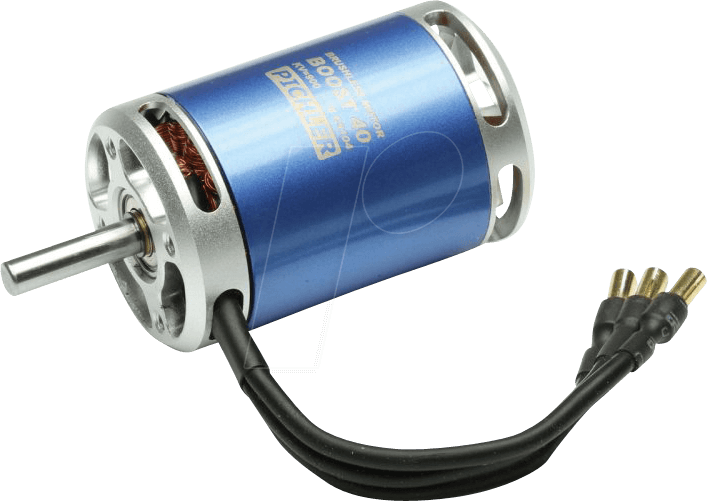

## Throttle

<p align="center">
  
</p>

### About

The node is a controller for the RC car motor (throttling).

Node is responsibe to process the input from the joystick and transform the Ackernmann message into the PWM values (integers). For the node we need to devine 3 constant values: PWM value that corresponds max speed backwards, PWM value for breackingand PWM values, that corresponds the maximum speed forwards. Based on the defined values, the node will always transform the received values to PWM and send it to the PCA9685 board.

### Feature

A brushless DC electric motor (BLDC motor or BL motor), also known as electronically commutated motor (ECM or EC motor) and synchronous DC motors, are synchronous motors powered by DC electricity via an inverter or switching power supply which produces an AC electric current to drive each phase of the motor via a closed loop controller. The controller provides pulses of current to the motor windings that control the speed and torque of the motor.

The construction of a brushless motor system is typically similar to a permanent magnet synchronous motor (PMSM), but can also be a switched reluctance motor, or an induction (asynchronous) motor.

The advantages of a brushless motor over brushed motors are high power to weight ratio, high speed, and electronic control. Brushless motors find applications in such places as computer peripherals (disk drives, printers), hand-held power tools, and vehicles ranging from model aircraft to automobiles.

For more information:
- https://en.wikipedia.org/wiki/Brushless_DC_electric_motor

### How to start the node

In order to start the node, use the following commands
```
git clone git@github.com:project-omicron/throttle.git
cd ./throttle/
roslaunch launch/config_throttle.launch
roslaunch launch/run_throttle.launch
```
